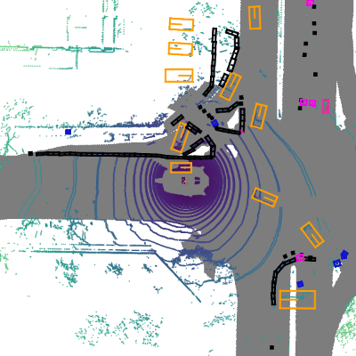

<div align="center">
  
  <div>&nbsp;</div>
  <div align="center">
    <b><font size="5">OpenMMLab 官网</font></b>
    <sup>
      <a href="https://openmmlab.com">
        <i><font size="4">HOT</font></i>
      </a>
    </sup>
    &nbsp;&nbsp;&nbsp;&nbsp;
    <b><font size="5">OpenMMLab 开放平台</font></b>
    <sup>
      <a href="https://platform.openmmlab.com">
        <i><font size="4">TRY IT OUT</font></i>
      </a>
    </sup>
  </div>
  <div>&nbsp;</div>

[](https://pypi.org/project/mmdet3d)
[](https://mmdetection3d.readthedocs.io/zh_CN/latest/)
[](https://github.com/open-mmlab/mmdetection3d/actions)
[](https://codecov.io/gh/open-mmlab/mmdetection3d)
[](https://github.com/open-mmlab/mmdetection3d/blob/main/LICENSE)
[](https://github.com/open-mmlab/mmdetection3d/issues)
[](https://github.com/open-mmlab/mmdetection3d/issues)

[📘使用文档](https://mmdetection3d.readthedocs.io/zh_CN/latest/) |
[🛠️安装教程](https://mmdetection3d.readthedocs.io/zh_CN/latest/get_started.html) |
[👀模型库](https://mmdetection3d.readthedocs.io/zh_CN/latest/model_zoo.html) |
[🆕更新日志](https://mmdetection3d.readthedocs.io/en/latest/notes/changelog.html) |
[🚀进行中的项目](https://github.com/open-mmlab/mmdetection3d/projects) |
[🤔报告问题](https://github.com/open-mmlab/mmdetection3d/issues/new/choose)

</div>

<div align="center">

[English](MMDetection3D.md) | 简体中文

</div>

<div align="center">
  <a href="https://openmmlab.medium.com/" style="text-decoration:none;">
    </a>
  
  <a href="https://discord.com/channels/1037617289144569886/1046608014234370059" style="text-decoration:none;">
    </a>
  
  <a href="https://twitter.com/OpenMMLab" style="text-decoration:none;">
    </a>
  
  <a href="https://www.youtube.com/openmmlab" style="text-decoration:none;">
    </a>
  
  <a href="https://space.bilibili.com/1293512903" style="text-decoration:none;">
    </a>
  
  <a href="https://www.zhihu.com/people/openmmlab" style="text-decoration:none;">
    </a>
</div>

## 简介

MMDetection3D 是一个基于 PyTorch 的目标检测开源工具箱，下一代面向 3D 检测的平台。它是 [OpenMMlab](https://openmmlab.com/) 项目的一部分。

主分支代码目前支持 PyTorch 1.8 以上的版本。



<details open>
<summary>主要特性</summary>

- **支持多模态/单模态的检测器**

  支持多模态/单模态检测器，包括 MVXNet，VoteNet，PointPillars 等。

- **支持户内/户外的数据集**

  支持室内/室外的 3D 检测数据集，包括 ScanNet，SUNRGB-D，Waymo，nuScenes，Lyft，KITTI。对于 nuScenes 数据集，我们也支持 [nuImages 数据集](https://github.com/open-mmlab/mmdetection3d/tree/main/configs/nuimages)。

- **与 2D 检测器的自然整合**

  [MMDetection](https://github.com/open-mmlab/mmdetection/blob/3.x/docs/zh_cn/model_zoo.md) 支持的 **300+ 个模型，40+ 的论文算法**，和相关模块都可以在此代码库中训练或使用。

- **性能高**

  训练速度比其他代码库更快。下表可见主要的对比结果。更多的细节可见[基准测评文档](./docs/zh_cn/notes/benchmarks.md)。我们对比了每秒训练的样本数（值越高越好）。其他代码库不支持的模型被标记为 `✗`。

  |       Methods       | MMDetection3D | [OpenPCDet](https://github.com/open-mmlab/OpenPCDet) | [votenet](https://github.com/facebookresearch/votenet) | [Det3D](https://github.com/poodarchu/Det3D) |
  | :-----------------: | :-----------: | :--------------------------------------------------: | :----------------------------------------------------: | :-----------------------------------------: |
  |       VoteNet       |      358      |                          ✗                           |                           77                           |                      ✗                      |
  |  PointPillars-car   |      141      |                          ✗                           |                           ✗                            |                     140                     |
  | PointPillars-3class |      107      |                          44                          |                           ✗                            |                      ✗                      |
  |       SECOND        |      40       |                          30                          |                           ✗                            |                      ✗                      |
  |       Part-A2       |      17       |                          14                          |                           ✗                            |                      ✗                      |

</details>

和 [MMDetection](https://github.com/open-mmlab/mmdetection)，[MMCV](https://github.com/open-mmlab/mmcv) 一样，MMDetection3D 也可以作为一个库去支持各式各样的项目。

## 最新进展

### 亮点

在1.4版本中，MMDetecion3D 重构了 Waymo 数据集, 加速了 Waymo 数据集的预处理、训练/测试启动、验证的速度。并且在 Waymo 上拓展了对 单目/BEV 等基于相机的三维目标检测模型的支持。在[这里](https://mmdetection3d.readthedocs.io/en/latest/advanced_guides/datasets/waymo.html)提供了对 Waymo 数据信息的详细解读。

此外，在1.4版本中，MMDetection3D 提供了 [Waymo-mini](https://download.openmmlab.com/mmdetection3d/data/waymo_mmdet3d_after_1x4/waymo_mini.tar.gz) 来帮助社区用户上手 Waymo 并用于快速迭代开发。

**v1.4.0** 版本已经在 2024.1.8 发布：

- 在 `projects` 中支持了 [DSVT](<(https://arxiv.org/abs/2301.06051)>) 的训练
- 在 `projects` 中支持了 [Nerf-Det](https://arxiv.org/abs/2307.14620)
- 重构了 Waymo 数据集

**v1.3.0** 版本已经在 2023.10.18 发布：

- 在 `projects` 中支持 [CENet](https://arxiv.org/abs/2207.12691)
- 使用新的 3D inferencers 增强演示代码效果

**v1.2.0** 版本已经在 2023.7.4 发布：

- 在 `mmdet3d/configs`中支持 [新Config样式](https://mmengine.readthedocs.io/en/latest/advanced_tutorials/config.html#a-pure-python-style-configuration-file-beta)
- 在 `projects` 中支持 [DSVT](<(https://arxiv.org/abs/2301.06051)>) 的推理
- 支持通过 `mim` 从 [OpenDataLab](https://opendatalab.com/) 下载数据集

**v1.1.1** 版本已经在 2023.5.30 发布：

- 在 `projects` 中支持 [TPVFormer](https://arxiv.org/pdf/2302.07817.pdf)
- 在 `projects` 中支持 BEVFusion 的训练
- 支持基于激光雷达的 3D 语义分割基准

## 安装

请参考[快速入门文档](https://mmdetection3d.readthedocs.io/zh_CN/latest/get_started.html)进行安装。

## 教程

<details>
<summary>用户指南</summary>

- [训练 & 测试](https://mmdetection3d.readthedocs.io/zh_CN/latest/user_guides/index.html#train-test)
  - [学习配置文件](https://mmdetection3d.readthedocs.io/zh_CN/latest/user_guides/config.html)
  - [坐标系](https://mmdetection3d.readthedocs.io/zh_CN/latest/user_guides/coord_sys_tutorial.html)
  - [数据预处理](https://mmdetection3d.readthedocs.io/zh_CN/latest/user_guides/dataset_prepare.html)
  - [自定义数据预处理流程](https://mmdetection3d.readthedocs.io/zh_CN/latest/user_guides/data_pipeline.html)
  - [在标注数据集上测试和训练](https://mmdetection3d.readthedocs.io/zh_CN/latest/user_guides/train_test.html)
  - [推理](https://mmdetection3d.readthedocs.io/zh_CN/latest/user_guides/inference.html)
  - [在自定义数据集上进行训练](https://mmdetection3d.readthedocs.io/zh_CN/latest/user_guides/new_data_model.html)
- [实用工具](https://mmdetection3d.readthedocs.io/zh_CN/latest/user_guides/index.html#useful-tools)

</details>

<details>
<summary>进阶教程</summary>

- [数据集](https://mmdetection3d.readthedocs.io/zh_CN/latest/advanced_guides/index.html#datasets)
  - [KITTI 数据集](https://mmdetection3d.readthedocs.io/zh_CN/latest/advanced_guides/datasets/kitti.html)
  - [NuScenes 数据集](https://mmdetection3d.readthedocs.io/zh_CN/latest/advanced_guides/datasets/nuscenes.html)
  - [Lyft 数据集](https://mmdetection3d.readthedocs.io/zh_CN/latest/advanced_guides/datasets/lyft.html)
  - [Waymo 数据集](https://mmdetection3d.readthedocs.io/zh_CN/latest/advanced_guides/datasets/waymo.html)
  - [SUN RGB-D 数据集](https://mmdetection3d.readthedocs.io/zh_CN/latest/advanced_guides/datasets/sunrgbd.html)
  - [ScanNet 数据集](https://mmdetection3d.readthedocs.io/zh_CN/latest/advanced_guides/datasets/scannet.html)
  - [S3DIS 数据集](https://mmdetection3d.readthedocs.io/zh_CN/latest/advanced_guides/datasets/s3dis.html)
  - [SemanticKITTI 数据集](https://mmdetection3d.readthedocs.io/zh_CN/latest/advanced_guides/datasets/semantickitti.html)
- [支持的任务](https://mmdetection3d.readthedocs.io/zh_CN/latest/advanced_guides/index.html#supported-tasks)
  - [基于激光雷达的 3D 检测](https://mmdetection3d.readthedocs.io/zh_CN/latest/advanced_guides/supported_tasks/lidar_det3d.html)
  - [基于视觉的 3D 检测](https://mmdetection3d.readthedocs.io/zh_CN/latest/advanced_guides/supported_tasks/vision_det3d.html)
  - [基于激光雷达的 3D 语义分割](https://mmdetection3d.readthedocs.io/zh_CN/latest/advanced_guides/supported_tasks/lidar_sem_seg3d.html)
- [自定义项目](https://mmdetection3d.readthedocs.io/zh_CN/latest/advanced_guides/index.html#customization)
  - [自定义数据集](https://mmdetection3d.readthedocs.io/zh_CN/latest/advanced_guides/customize_dataset.html)
  - [自定义模型](https://mmdetection3d.readthedocs.io/zh_CN/latest/advanced_guides/customize_models.html)
  - [自定义运行时配置](https://mmdetection3d.readthedocs.io/zh_CN/latest/advanced_guides/customize_runtime.html)

</details>

## 基准测试和模型库

测试结果和模型可以在[模型库](docs/zh_cn/model_zoo.md)中找到。

<div align="center">
  <b>模块组件</b>
</div>
<table align="center">
  <tbody>
    <tr align="center" valign="bottom">
      <td>
        <b>主干网络</b>
      </td>
      <td>
        <b>检测头</b>
      </td>
      <td>
        <b>特性</b>
      </td>
    </tr>
    <tr valign="top">
      <td>
      <ul>
        <li><a href="configs/pointnet2">PointNet (CVPR'2017)</a></li>
        <li><a href="configs/pointnet2">PointNet++ (NeurIPS'2017)</a></li>
        <li><a href="configs/regnet">RegNet (CVPR'2020)</a></li>
        <li><a href="configs/dgcnn">DGCNN (TOG'2019)</a></li>
        <li>DLA (CVPR'2018)</li>
        <li>MinkResNet (CVPR'2019)</li>
        <li><a href="configs/minkunet">MinkUNet (CVPR'2019)</a></li>
        <li><a href="configs/cylinder3d">Cylinder3D (CVPR'2021)</a></li>
      </ul>
      </td>
      <td>
      <ul>
        <li><a href="configs/free_anchor">FreeAnchor (NeurIPS'2019)</a></li>
      </ul>
      </td>
      <td>
      <ul>
        <li><a href="configs/dynamic_voxelization">Dynamic Voxelization (CoRL'2019)</a></li>
      </ul>
      </td>
    </tr>
</td>
    </tr>
  </tbody>
</table>

<div align="center">
  <b>算法模型</b>
</div>
<table align="center">
  <tbody>
    <tr align="center" valign="middle">
      <td>
        <b>激光雷达 3D 目标检测</b>
      </td>
      <td>
        <b>相机 3D 目标检测</b>
      </td>
      <td>
        <b>多模态 3D 目标检测</b>
      </td>
      <td>
        <b>3D 语义分割</b>
      </td>
    </tr>
    <tr valign="top">
      <td>
        <li><b>室外</b></li>
        <ul>
            <li><a href="configs/second">SECOND (Sensor'2018)</a></li>
            <li><a href="configs/pointpillars">PointPillars (CVPR'2019)</a></li>
            <li><a href="configs/ssn">SSN (ECCV'2020)</a></li>
            <li><a href="configs/3dssd">3DSSD (CVPR'2020)</a></li>
            <li><a href="configs/sassd">SA-SSD (CVPR'2020)</a></li>
            <li><a href="configs/point_rcnn">PointRCNN (CVPR'2019)</a></li>
            <li><a href="configs/parta2">Part-A2 (TPAMI'2020)</a></li>
            <li><a href="configs/centerpoint">CenterPoint (CVPR'2021)</a></li>
            <li><a href="configs/pv_rcnn">PV-RCNN (CVPR'2020)</a></li>
            <li><a href="projects/CenterFormer">CenterFormer (ECCV'2022)</a></li>
        </ul>
        <li><b>室内</b></li>
        <ul>
            <li><a href="configs/votenet">VoteNet (ICCV'2019)</a></li>
            <li><a href="configs/h3dnet">H3DNet (ECCV'2020)</a></li>
            <li><a href="configs/groupfree3d">Group-Free-3D (ICCV'2021)</a></li>
            <li><a href="configs/fcaf3d">FCAF3D (ECCV'2022)</a></li>
            <li><a href="projects/TR3D">TR3D (ArXiv'2023)</a></li>
      </ul>
      </td>
      <td>
        <li><b>室外</b></li>
        <ul>
          <li><a href="configs/imvoxelnet">ImVoxelNet (WACV'2022)</a></li>
          <li><a href="configs/smoke">SMOKE (CVPRW'2020)</a></li>
          <li><a href="configs/fcos3d">FCOS3D (ICCVW'2021)</a></li>
          <li><a href="configs/pgd">PGD (CoRL'2021)</a></li>
          <li><a href="configs/monoflex">MonoFlex (CVPR'2021)</a></li>
          <li><a href="projects/DETR3D">DETR3D (CoRL'2021)</a></li>
          <li><a href="projects/PETR">PETR (ECCV'2022)</a></li>
        </ul>
        <li><b>Indoor</b></li>
        <ul>
          <li><a href="configs/imvoxelnet">ImVoxelNet (WACV'2022)</a></li>
        </ul>
      </td>
      <td>
        <li><b>室外</b></li>
        <ul>
          <li><a href="configs/mvxnet">MVXNet (ICRA'2019)</a></li>
          <li><a href="projects/BEVFusion">BEVFusion (ICRA'2023)</a></li>
        </ul>
        <li><b>室内</b></li>
        <ul>
          <li><a href="configs/imvotenet">ImVoteNet (CVPR'2020)</a></li>
        </ul>
      </td>
      <td>
        <li><b>室外</b></li>
        <ul>
          <li><a href="configs/minkunet">MinkUNet (CVPR'2019)</a></li>
          <li><a href="configs/spvcnn">SPVCNN (ECCV'2020)</a></li>
          <li><a href="configs/cylinder3d">Cylinder3D (CVPR'2021)</a></li>
          <li><a href="projects/TPVFormer">TPVFormer (CVPR'2023)</a></li>
        </ul>
        <li><b>室内</b></li>
        <ul>
          <li><a href="configs/pointnet2">PointNet++ (NeurIPS'2017)</a></li>
          <li><a href="configs/paconv">PAConv (CVPR'2021)</a></li>
          <li><a href="configs/dgcnn">DGCNN (TOG'2019)</a></li>
        </ul>
      </ul>
      </td>
    </tr>
</td>
    </tr>
  </tbody>
</table>

|               | ResNet | VoVNet | Swin-T | PointNet++ | SECOND | DGCNN | RegNetX | DLA | MinkResNet | Cylinder3D | MinkUNet |
| :-----------: | :----: | :----: | :----: | :--------: | :----: | :---: | :-----: | :-: | :--------: | :--------: | :------: |
|    SECOND     |   ✗    |   ✗    |   ✗    |     ✗      |   ✓    |   ✗   |    ✗    |  ✗  |     ✗      |     ✗      |    ✗     |
| PointPillars  |   ✗    |   ✗    |   ✗    |     ✗      |   ✓    |   ✗   |    ✓    |  ✗  |     ✗      |     ✗      |    ✗     |
|  FreeAnchor   |   ✗    |   ✗    |   ✗    |     ✗      |   ✗    |   ✗   |    ✓    |  ✗  |     ✗      |     ✗      |    ✗     |
|    VoteNet    |   ✗    |   ✗    |   ✗    |     ✓      |   ✗    |   ✗   |    ✗    |  ✗  |     ✗      |     ✗      |    ✗     |
|    H3DNet     |   ✗    |   ✗    |   ✗    |     ✓      |   ✗    |   ✗   |    ✗    |  ✗  |     ✗      |     ✗      |    ✗     |
|     3DSSD     |   ✗    |   ✗    |   ✗    |     ✓      |   ✗    |   ✗   |    ✗    |  ✗  |     ✗      |     ✗      |    ✗     |
|    Part-A2    |   ✗    |   ✗    |   ✗    |     ✗      |   ✓    |   ✗   |    ✗    |  ✗  |     ✗      |     ✗      |    ✗     |
|    MVXNet     |   ✓    |   ✗    |   ✗    |     ✗      |   ✓    |   ✗   |    ✗    |  ✗  |     ✗      |     ✗      |    ✗     |
|  CenterPoint  |   ✗    |   ✗    |   ✗    |     ✗      |   ✓    |   ✗   |    ✗    |  ✗  |     ✗      |     ✗      |    ✗     |
|      SSN      |   ✗    |   ✗    |   ✗    |     ✗      |   ✗    |   ✗   |    ✓    |  ✗  |     ✗      |     ✗      |    ✗     |
|   ImVoteNet   |   ✓    |   ✗    |   ✗    |     ✓      |   ✗    |   ✗   |    ✗    |  ✗  |     ✗      |     ✗      |    ✗     |
|    FCOS3D     |   ✓    |   ✗    |   ✗    |     ✗      |   ✗    |   ✗   |    ✗    |  ✗  |     ✗      |     ✗      |    ✗     |
|  PointNet++   |   ✗    |   ✗    |   ✗    |     ✓      |   ✗    |   ✗   |    ✗    |  ✗  |     ✗      |     ✗      |    ✗     |
| Group-Free-3D |   ✗    |   ✗    |   ✗    |     ✓      |   ✗    |   ✗   |    ✗    |  ✗  |     ✗      |     ✗      |    ✗     |
|  ImVoxelNet   |   ✓    |   ✗    |   ✗    |     ✗      |   ✗    |   ✗   |    ✗    |  ✗  |     ✗      |     ✗      |    ✗     |
|    PAConv     |   ✗    |   ✗    |   ✗    |     ✓      |   ✗    |   ✗   |    ✗    |  ✗  |     ✗      |     ✗      |    ✗     |
|     DGCNN     |   ✗    |   ✗    |   ✗    |     ✗      |   ✗    |   ✓   |    ✗    |  ✗  |     ✗      |     ✗      |    ✗     |
|     SMOKE     |   ✗    |   ✗    |   ✗    |     ✗      |   ✗    |   ✗   |    ✗    |  ✓  |     ✗      |     ✗      |    ✗     |
|      PGD      |   ✓    |   ✗    |   ✗    |     ✗      |   ✗    |   ✗   |    ✗    |  ✗  |     ✗      |     ✗      |    ✗     |
|   MonoFlex    |   ✗    |   ✗    |   ✗    |     ✗      |   ✗    |   ✗   |    ✗    |  ✓  |     ✗      |     ✗      |    ✗     |
|    SA-SSD     |   ✗    |   ✗    |   ✗    |     ✗      |   ✓    |   ✗   |    ✗    |  ✗  |     ✗      |     ✗      |    ✗     |
|    FCAF3D     |   ✗    |   ✗    |   ✗    |     ✗      |   ✗    |   ✗   |    ✗    |  ✗  |     ✓      |     ✗      |    ✗     |
|    PV-RCNN    |   ✗    |   ✗    |   ✗    |     ✗      |   ✓    |   ✗   |    ✗    |  ✗  |     ✗      |     ✗      |    ✗     |
|  Cylinder3D   |   ✗    |   ✗    |   ✗    |     ✗      |   ✗    |   ✗   |    ✗    |  ✗  |     ✗      |     ✓      |    ✗     |
|   MinkUNet    |   ✗    |   ✗    |   ✗    |     ✗      |   ✗    |   ✗   |    ✗    |  ✗  |     ✗      |     ✗      |    ✓     |
|    SPVCNN     |   ✗    |   ✗    |   ✗    |     ✗      |   ✗    |   ✗   |    ✗    |  ✗  |     ✗      |     ✗      |    ✓     |
|   BEVFusion   |   ✗    |   ✗    |   ✓    |     ✗      |   ✓    |   ✗   |    ✗    |  ✗  |     ✗      |     ✗      |    ✗     |
| CenterFormer  |   ✗    |   ✗    |   ✗    |     ✗      |   ✓    |   ✗   |    ✗    |  ✗  |     ✗      |     ✗      |    ✗     |
|     TR3D      |   ✗    |   ✗    |   ✗    |     ✗      |   ✗    |   ✗   |    ✗    |  ✗  |     ✓      |     ✗      |    ✗     |
|    DETR3D     |   ✓    |   ✓    |   ✗    |     ✗      |   ✗    |   ✗   |    ✗    |  ✗  |     ✗      |     ✗      |    ✗     |
|     PETR      |   ✗    |   ✓    |   ✗    |     ✗      |   ✗    |   ✗   |    ✗    |  ✗  |     ✗      |     ✗      |    ✗     |
|   TPVFormer   |   ✓    |   ✗    |   ✗    |     ✗      |   ✗    |   ✗   |    ✗    |  ✗  |     ✗      |     ✗      |    ✗     |

**注意：**[MMDetection](https://github.com/open-mmlab/mmdetection/blob/3.x/docs/zh_cn/model_zoo.md) 支持的基于 2D 检测的 **300+ 个模型，40+ 的论文算法**在 MMDetection3D 中都可以被训练或使用。

## 常见问题

请参考 [FAQ](docs/zh_cn/notes/faq.md) 了解其他用户的常见问题。

## 贡献指南

我们感谢所有的贡献者为改进和提升 MMDetection3D 所作出的努力。请参考[贡献指南](docs/en/notes/contribution_guides.md)来了解参与项目贡献的相关指引。

## 致谢

MMDetection3D 是一款由来自不同高校和企业的研发人员共同参与贡献的开源项目。我们感谢所有为项目提供算法复现和新功能支持的贡献者，以及提供宝贵反馈的用户。我们希望这个工具箱和基准测试可以为社区提供灵活的代码工具，供用户复现已有算法并开发自己的新的 3D 检测模型。

## 引用

如果你觉得本项目对你的研究工作有所帮助，请参考如下 bibtex 引用 MMdetection3D：

```latex
@misc{mmdet3d2020,
    title={{MMDetection3D: OpenMMLab} next-generation platform for general {3D} object detection},
    author={MMDetection3D Contributors},
    howpublished = {\url{https://github.com/open-mmlab/mmdetection3d}},
    year={2020}
}
```

## 开源许可证

该项目采用 [Apache 2.0 开源许可证](LICENSE)。

## OpenMMLab 的其他项目

- [MMEngine](https://github.com/open-mmlab/mmengine): OpenMMLab 深度学习模型训练基础库
- [MMCV](https://github.com/open-mmlab/mmcv): OpenMMLab 计算机视觉基础库
- [MMEval](https://github.com/open-mmlab/mmeval): 统一开放的跨框架算法评测库
- [MIM](https://github.com/open-mmlab/mim): MIM 是 OpenMMlab 项目、算法、模型的统一入口
- [MMPreTrain](https://github.com/open-mmlab/mmpretrain): OpenMMLab 深度学习预训练工具箱
- [MMDetection](https://github.com/open-mmlab/mmdetection): OpenMMLab 目标检测工具箱
- [MMDetection3D](https://github.com/open-mmlab/mmdetection3d): OpenMMLab 新一代通用 3D 目标检测平台
- [MMRotate](https://github.com/open-mmlab/mmrotate): OpenMMLab 旋转框检测工具箱与测试基准
- [MMYOLO](https://github.com/open-mmlab/mmyolo): OpenMMLab YOLO 系列工具箱与测试基准
- [MMSegmentation](https://github.com/open-mmlab/mmsegmentation): OpenMMLab 语义分割工具箱
- [MMOCR](https://github.com/open-mmlab/mmocr): OpenMMLab 全流程文字检测识别理解工具包
- [MMPose](https://github.com/open-mmlab/mmpose): OpenMMLab 姿态估计工具箱
- [MMHuman3D](https://github.com/open-mmlab/mmhuman3d): OpenMMLab 人体参数化模型工具箱与测试基准
- [MMSelfSup](https://github.com/open-mmlab/mmselfsup): OpenMMLab 自监督学习工具箱与测试基准
- [MMRazor](https://github.com/open-mmlab/mmrazor): OpenMMLab 模型压缩工具箱与测试基准
- [MMFewShot](https://github.com/open-mmlab/mmfewshot): OpenMMLab 少样本学习工具箱与测试基准
- [MMAction2](https://github.com/open-mmlab/mmaction2): OpenMMLab 新一代视频理解工具箱
- [MMTracking](https://github.com/open-mmlab/mmtracking): OpenMMLab 一体化视频目标感知平台
- [MMFlow](https://github.com/open-mmlab/mmflow): OpenMMLab 光流估计工具箱与测试基准
- [MMagic](https://github.com/open-mmlab/mmagic): OpenMMLab 新一代人工智能内容生成（AIGC）工具箱
- [MMGeneration](https://github.com/open-mmlab/mmgeneration): OpenMMLab 图片视频生成模型工具箱
- [MMDeploy](https://github.com/open-mmlab/mmdeploy): OpenMMLab 模型部署框架

## 欢迎加入 OpenMMLab 社区

扫描下方的二维码可关注 OpenMMLab 团队的 [知乎官方账号](https://www.zhihu.com/people/openmmlab)，扫描下方微信二维码添加喵喵好友，进入 MMDetection3D 微信交流社群。【加好友申请格式：研究方向+地区+学校/公司+姓名】

<div align="center">
  
</div>

我们会在 OpenMMLab 社区为大家

- 📢 分享 AI 框架的前沿核心技术
- 💻 解读 PyTorch 常用模块源码
- 📰 发布 OpenMMLab 的相关新闻
- 🚀 介绍 OpenMMLab 开发的前沿算法
- 🏃 获取更高效的问题答疑和意见反馈
- 🔥 提供与各行各业开发者充分交流的平台

干货满满 📘，等你来撩 💗，OpenMMLab 社区期待您的加入 👬
